# 安卓抓包之导入HTTPS证书

## 前言

在Android渗透和逆向分析中，抓包是一个非常基础，也是非常重要的技术，如果在渗透Android应用的时候，连包都抓不下来，就谈不上漏洞挖掘和漏洞研究了，也许有很多同学碰到抓不到包的时候就放弃了。那么，本篇将会讲解如何使用**Charles**和**Burpsuite**进行抓包，以及如何抓取HTTPS的包。

> 准备：一个root过的Android手机，本篇的系统环境是Kali虚拟机

## 一、Charles抓包

### 0x00 主要步骤

+ 安装 Charles 抓包工具
+ 抓包尝试
+ 将 Charles 证书导入手机
+ 将用户证书移动到系统信任的证书
+ 抓取 HTTPS 包

### 0x01 安装 Charles 抓包工具

Charles下载地址：https://www.charlesproxy.com/download/latest-release/，本篇以Kali虚拟机为实验环境，所以下载linux版本的Charles：

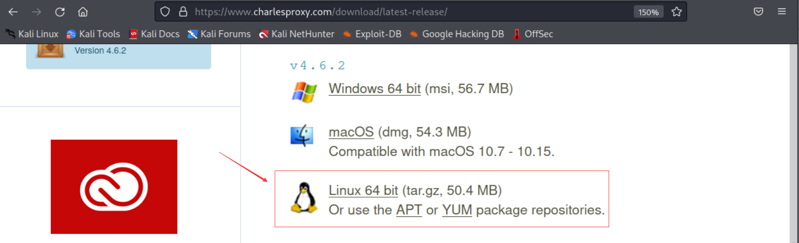

下载完成之后，解压出来，切换到 charles/bin 目录下，执行 ./charles

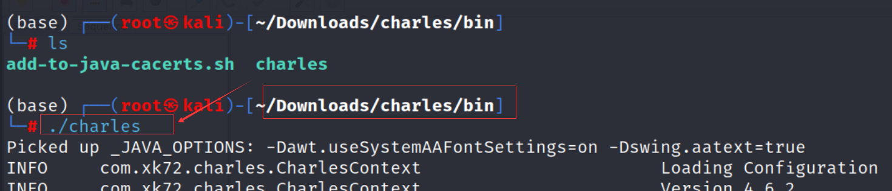

Charles界面如下：

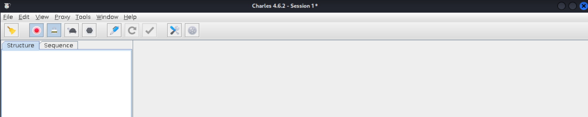

### 0x02 抓包尝试

代理设置，点击 proxy->Proxy Settings ，可以更改默认的8888端口，改成其他没有被系统占用的端口，都可以

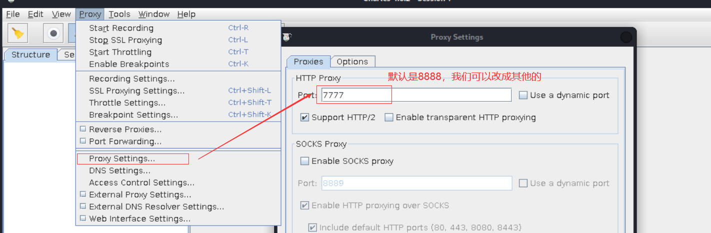

手机上设置手动代理：

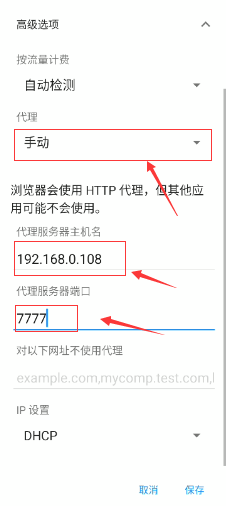

此时，手机使用浏览器浏览网站，比如说打开百度搜索，此时抓包，发现提示”该证书并非来自可信的授权中心“，所以抓取https包的时候，看不到明文：

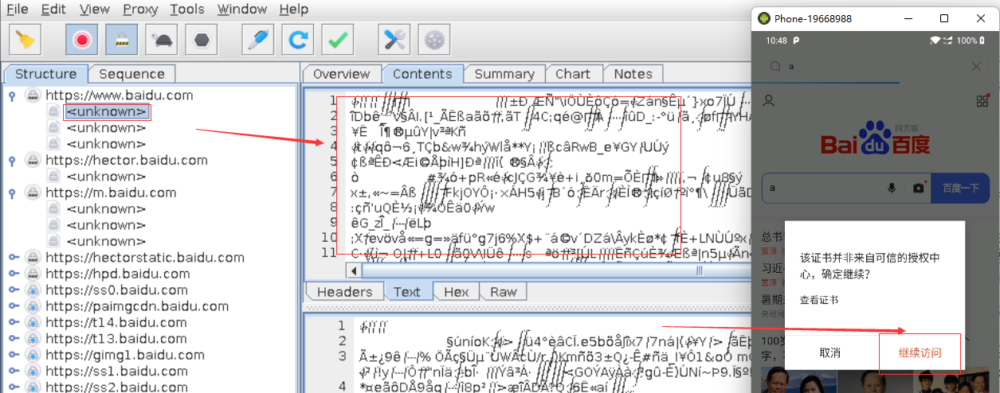

此时我们需要将 Charles的证书导入到手机中，才可以抓取 HTTPS 的包

### 0x03 将 Charles 证书导入手机

首先手机访问： http://chls.pro/ssl，选择下载证书

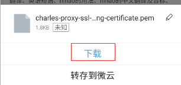

下载完成之后，点击安装证书

+ 在手机配置中，找到 安全和锁屏 -> 加密与凭据 -> 从储存设备安装，找到下载的 pem 证书，点击安装，填写证书名称

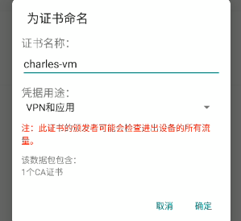

+ 此时已经可以抓取浏览器的https的包了

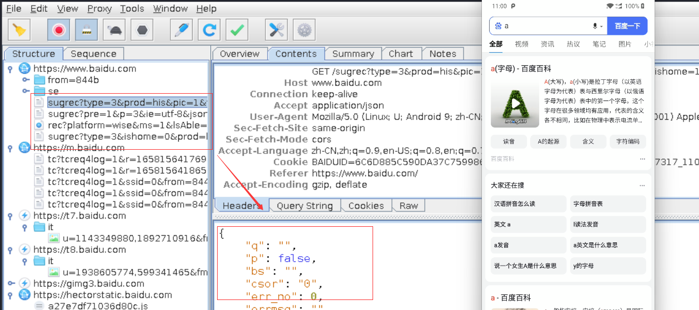

+ 如何你此时抓取浏览器的https的包，还是乱码，那么注意需要在 Charles 配置一下，点击菜单 Proxy-> SSL Proxying Settings，然后选择 SSL Proxying中的 add，添加host和port，这里*号表示任意，443表示默认的HTTPS的端口

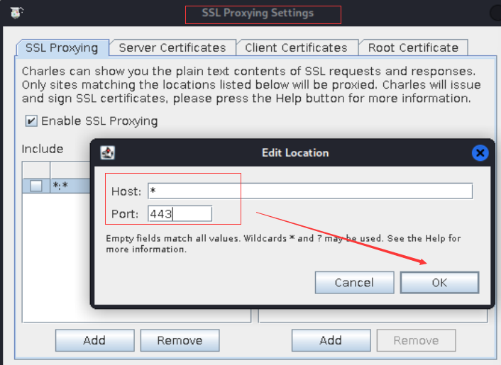

+ 但是其他的App，很多得包抓不到，此时就需要将证书移动到系统信任

### 0x04 将用户证书移动到系统信任的证书

打开 Magisk（我的版本是Magisk 23），可以直接从模块中搜索 ”Move Certifacates“，然后安装该模块，最后重启，重启之后，就自动将用户的证书移动到系统内置的证书了

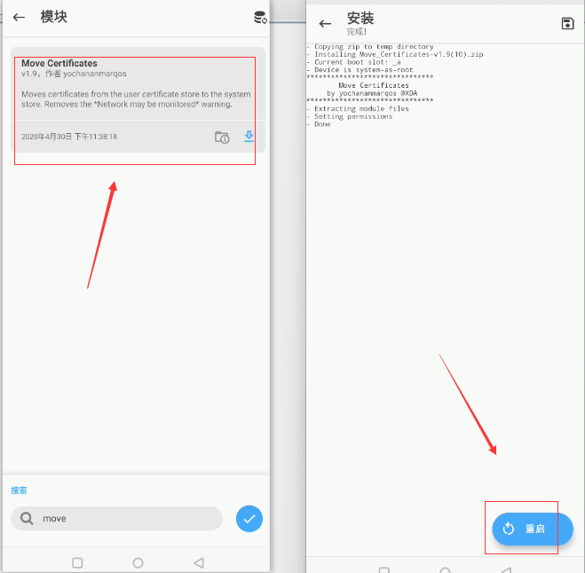

### 0x05 抓取 HTTPS 包

重启之后可以看到，charles的证书已经移动到系统信任的凭据中

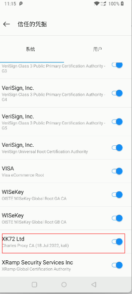

此时我们再尝试抓取一些 App（没有做其他放抓包的应用），发现之前抓取不了的，现在可以抓了，具体的应用大家可以自己尝试。

## 二、Burpsuite抓包

Burpsuite抓取Android 包的方法和Charles类似的，只是导出证书之一步骤有点不同，所以我们单独说明以下之一步骤

### 导入Burp证书

首先导出burp证书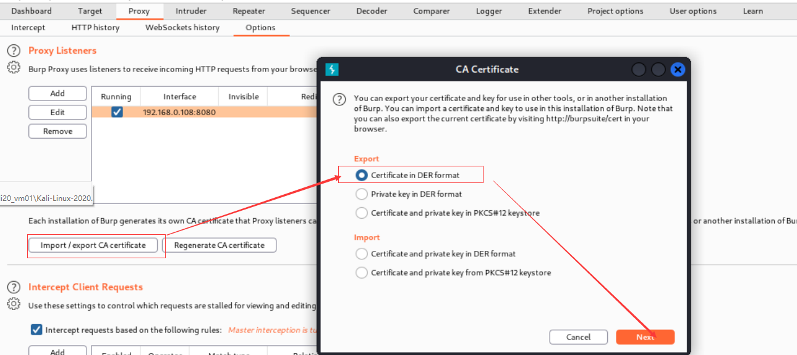

可以保存为 burp.der：

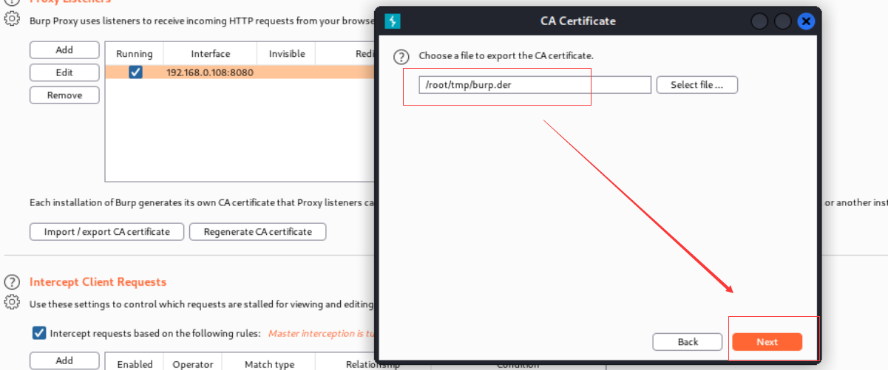

然后切换到下载的目录，执行 `openssl x509 -inform der -in burp.der  -out burp.pem`， 将 der 文件转为 pem文件

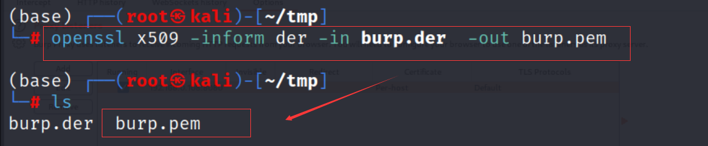

接下来的步骤和前面 Charles 一样了，导入手机，安装证书，然后重启（前面已经通过Magisk安装了 Move Certificates 模块），就可以将burpsuite的证书导入系统信任的凭据中了

### 抓包尝试

发现已经可以抓取https的包了

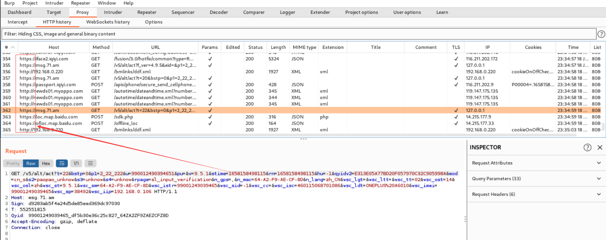

## 总结

不管是 Charles 还是 Burptsuite 抓包，原理是相似的，核心就是将 证书导入系统信任的凭据中。