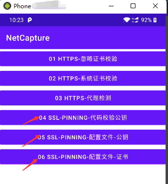

# Android渗透-04：安卓抓包之绕过SSL Pinning

## 0x00 前言

在对Android应用进行渗透测试时，通常需要是对App产生的网络报文进行抓取。开发人员为了对抗抓包，也会采取相应的防御技术，常见的方式有：客户端检测服务端的证书、检测是否使用代理、SSL Pinning（证证书锁定）、客户端与服务端双向校验。

对于客户端校验服务端证书这种检测方式，只要将代理（比如 Charles、Burpsuite等）证书内置到系统信任的凭据中，就可以抓取Https的请求包；检测是否使用代理，可以使用v-p-n 抓包进行绕过。对于以上两种我们在前两篇的文章已经分享过了。本篇文章，我们主要分享 SSL Pinning的实现和绕过。

## 0x01 SSL Pinning是什么？

SSL Pinning 也称为证书锁定，是Google官方推荐的检验方式，意思是将服务器提供的SSL/TLS证书内置到移动客户端，当客户端发起请求的时候，通过对比内置的证书与服务器的证书是否一致，来确认这个连接的合法性。

## 0x02  如何实现SSL Pinning ？

SSL Pinning 一般实现方式有两种，一种是在代码层进行校验，一种是通过配置文件 `network_security_config.xml` 进行配置实现校验。

### 2.1 代码层校验

下面是以 okhttp 网络框架举例，在代码校验证书公钥的代码如下：

### 2.2 配置文件实现

通过 `res/xml/network_security_config.xml` 进行配置，实现SSL Pinning，配置文件可以分为两种，使用证书校验和公钥校验。

使用证书锁定，由于CA签发证书存在有效期的问题，所以在证书续期后，需要将证书重新内置到App中。

使用公钥锁定，需要提取证书中的公钥并内置到app中，公钥在证书续期后可以保持不变(即密钥对可以不变)，可以避免有效期问题。

下面我们先看看证书锁定和公钥锁定的具体配置实现：

SSL Pinning 具体的实现的代码，可以查看：https://github.com/act0rn/https-capture

这个案例代码实现了常见的证书对抗，App运行 如下：

##0x03 如何绕过 SSL Pinning？

此时，我们打开测试的App，然后点击后面三个按钮（04、05、06按钮），并使用抓包工具（例如Charles ）进行抓包，发现抓包失败，提示信息如下：

这里提示 `Client closed the connection before a request was made. Possibly the SSL certificate was rejected`，提示证书校验失败。

那么如何绕过SSL Pinning 进行抓包呢？

我们这里使用 Frida 或者 Objection Hook工具可以实现绕过检测，关于具体Frida和Objection怎么安装，大家可以自行网上搜索，在之后会单独出 Frida 和 Objection 相关的文章。

### 3.1 使用Objection绕过

使用 objection 启动explore模式：`objection -g com.actorn.netcapture explore`

然后再输入 `android sslpinning disable` 绕过证书绑定

然后再点击app的后三个按钮，就可以抓到https的请求包了

### 3.2 使用 Frida 进行Hook绕过

Objection 是基于 Frida的，如果不使用 objection，我们自己写 hook脚本，当然也可以实现了，这里我们参照 Objection 的脚本来写 Frida 的Hook脚本

**绕过代码层检测公钥**

写好hook脚本后，使用frida 加载执行：

输入hook的函数 unpinningSsl1() ，然后点击app中的第四个按钮，发现可以抓取代码层校验的包

**绕过配置文件校验**

代码如下：

加载写好的hook脚本，然后输入 unpinningSsl2() 函数：

然后在点击app中的第5和第6个按钮，发现可以抓取这两个的请求包

## 0x04 小结

本文分享了SSL Pinning 的常见实现方式，可以通过代码层校验证书的公钥，也可以通过配置文件进行证书校验，还分享了通过 Hook 技术绕过常规的 SSL Pinning。

**喜欢本文的朋友，欢迎点赞转发，点击在看，可以让更多朋友看到**

----

感谢关注壹零安全，也欢迎加入星球讨论

