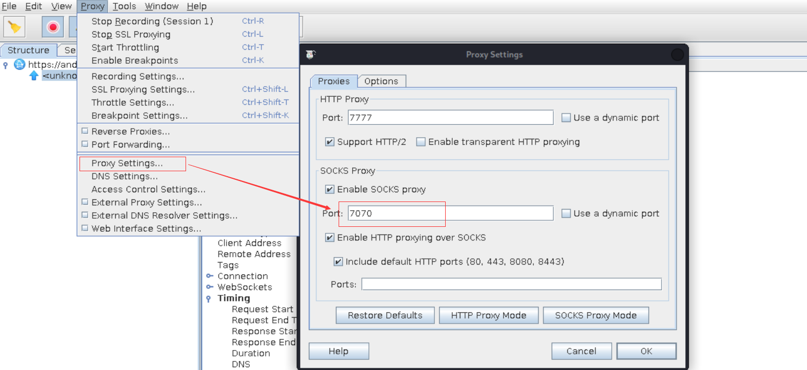
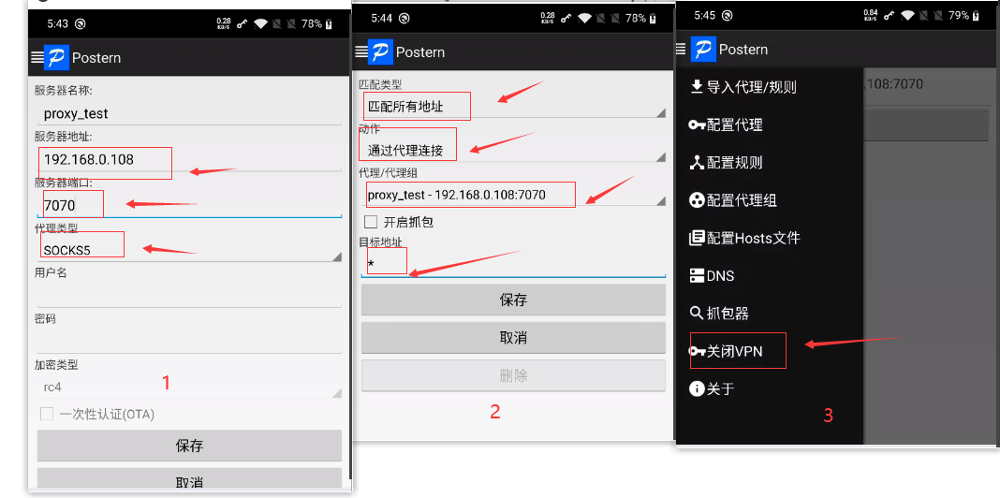
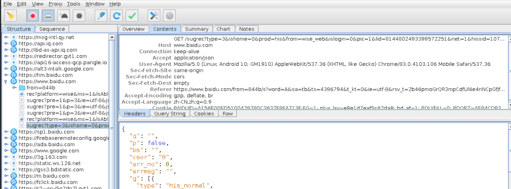

# Android渗透-03：安卓抓包之绕过代理检测抓包

上一篇我们分享了如何使用Charles和Burpsuite抓取安卓APP的请求包，当抓取HTTPS请求包的时候，还需要导入证书，在Android7之后安卓不再信任用户证书，还需要将用户证书导入系统信任的凭据中。很多应用为了防止抓包还会检测是否使用代理， 如果发现有代理，就不发起请求，此时我们可以通过 V-P-N代理抓包。

## 0x00 准备

本次我们使用 Postern（Postern是Android系统里一款非常流行的代理/ 虚拟专用网络管理程序，是一个Android下的全局代理工具）设置代理 ，下载 Postern apk：https://www.apkmonk.com/app/com.tunnelworkshop.postern/。

## 0x01 配置 Charles

选择 Proxy -> Proxy Settings ，勾选socks proxy，配置端口

## 0x02 手机安装 Postern 并配置

手机安卓下载好的 Postern apk，安卓之后进行代理配置

+ 选择配置代理，填写代理服务器地址，代理端口，协议类型改为 socks5

+ 然后，选择配置规则，具体如下图
+ 开启v-p-n选项

## 0x03 抓包尝试

尝试抓包，可以成功抓取https的请求

## 0x04 结语

本篇分享了通过Charles 结合 v-p-n 代理的方式进行抓包，目前为止，已经可以抓取很多App的请求包了。但是在实战中，还有部分App进行防抓包的校验，比如采用 SSL Pinning以及双向校验等防御手段，此时，我们就需要采用相应的绕过和对抗的技术，接下来会继续分享对抗抓包的相关技术。

----

感谢关注壹零安全，也欢迎加入星球讨论

