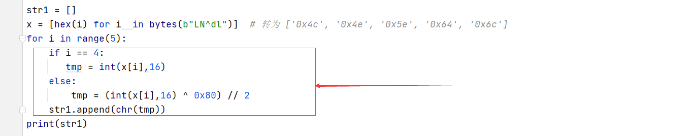

# Android渗透08：安卓CTF系列-案例2

## 0x00 前言

这是安卓 CTF 实战系列的第二个案例，本系列以实战方式，分享安卓渗透与逆向分析相关的技术。朋友们可以下载 CTF 的 apk 文件，进行分析学习

本文涉及技术：

+ IDA pro 工具使用
+ ARM 汇编基础
+ c /c++ 阅读能力
+ python 脚本编写能力

> 本案例所需要的 apk 文件，已经上传到知识星球，需要的朋友可以到文末关注后下载


## 0x01 查看代码

下载案例的 apk 文件，安装到手机


首先将 apk 文件拖入反编译工具 Jadx-gui 中，分析 MainActivity 中的代码


看到这里的关键是 `JNI.getResult(str)` 这里如果返回 1 ，就过关了，接下来分析 `JNI.getResult(str)` 这个方法

```java
package com.example.test.ctf03;

/* loaded from: classes.dex */
public class JNI {
    public static native int getResult(String str);

    static {
        System.loadLibrary("Native");
    }
}
```

发现 `getResult` 是 native 方法，其中的代码逻辑写在 so 文件中

下面就需要分析 so 文件，解压 apk 文件，在lib目录中找到 `ctf2\lib\armeabi-v7a\libNative.so`，分析 so 文件，一般可以使用 IDA pro 逆向工具进行分析

打开 IDA pro ，加载 so 文件，搜索 getResult 方法，定位到这个方法对应的汇编代码：


直接看 ARM 汇编代码，还是比较费劲的，我们可以使用 F5 快捷键，转为c/c++ 伪代码

```c
bool __fastcall Java_com_example_test_ctf03_JNI_getResult(JNIEnv *env, jobject obj, int a3)
{
  _BOOL4 v3; // r4
  const char *v4; // r8
  char *v5; // r6
  char *v6; // r4
  char *v7; // r5
  int i; // r0
  int j; // r0

  v3 = 0;
  v4 = (*env)->GetStringUTFChars(env, a3, 0);
  if ( strlen(v4) == 15 )
  {
    v5 = (char *)malloc(1u);
    v6 = (char *)malloc(1u);
    v7 = (char *)malloc(1u);
    Init(v5, v6, v7, v4, 15);
    if ( !First(v5) )
      goto LABEL_6;
    for ( i = 0; i != 4; ++i )
      v6[i] ^= v5[i];
    if ( !strcmp(v6, a5) )
    {
      for ( j = 0; j != 4; ++j )
        v7[j] ^= v6[j];
      v3 = strcmp(v7, "AFBo}") == 0;
    }
    else
    {
LABEL_6:
      v3 = 0;
    }
  }
  return v3;
}
```

## 0x02 静态分析 so 代码

分析 **Java_com_example_test_ctf03_JNI_getResult** 函数的逻辑，flag 值长度为 15 位，请看一下核心代码：


15 位长度的 flag，通过 Init 函数处理，得到三个5位长度的字符串，逻辑如下：

```c
int __fastcall Init(int result, char *a2, char *a3, const char *a4, int a5)
{
  int v5; // r5
  int v6; // r10
  int v7; // r6

  if ( a5 < 1 )
  {
    v6 = 0;
  }
  else
  {
    v5 = 0;
    v6 = 0;
    do
    {
      v7 = v5 % 3;
      if ( v5 % 3 == 2 )
      {
        a3[v5 / 3u] = a4[v5];
      }
      else if ( v7 == 1 )
      {
        a2[v5 / 3u] = a4[v5];
      }
      else if ( !v7 )
      {
        ++v6;
        *(_BYTE *)(result + v5 / 3u) = a4[v5];
      }
      ++v5;
    }
    while ( a5 != v5 );
  }
  *(_BYTE *)(result + v6) = 0;
  a2[v6] = 0;
  a3[v6] = 0;
  return result;
}
```

分析可以知道，**字符串1** 由15位flag的 1、4、7、10、13 字符组成，**字符串2** 由15位flag的 2、5、8、11、14，**字符串3** 由15位flag的 3、6、9、12、15 字符组成

接下来要分析的到 字符串1、字符串2、字符串3 ，就可以得到 flag值了

### 2.1 得到字符串1

这里 First(v5) 返回值要为 1

```java
 if ( !First(v5) )
      goto LABEL_6;
```

分析 First 函数

```c
bool __fastcall First(char *a1)
{
  int i; // r1

  for ( i = 0; i != 4; ++i )
    a1[i] = (2 * a1[i]) ^ 0x80;
  return strcmp(a1, "LN^dl") == 0;
}
```

从这里我们可以反推出 字符串1 的值，使用 python 写个脚本：




###2.2 得到字符串2

分析以下代码

```c
for ( i = 0; i != 4; ++i )
      v6[i] ^= v5[i];
    if ( !strcmp(v6, a5) )
```

双击 a5 ，可以看到 a5 对应的字符串


得到 a5 `的值 [0x20,0x35,0x2D,0x16,0x61]` ，写个脚本得到 字符串2 的值


### 2.3 得到字符串3

分下一下代码

```c
for ( j = 0; j != 4; ++j )
        v7[j] ^= v6[j];
      v3 = strcmp(v7, "AFBo}") == 0;
```

其中 v7 的值为 `AFBo}` ，分析代码，得到 字符串3 的值：


### 2.4 得到flag值

已经拿到 str1 str2 str3 ，就可以生成最终的 flag 值了：


## 0x03 过关

输入 flag 值，过关成功：


## 0x04 结语

本案例中，过关的关键在于分析 so 文件中代码，可以使用 IDA pro 工具进行静态分析，可以直接分析 arm 汇编代码，也可以转为c/c++ 的伪代码。


